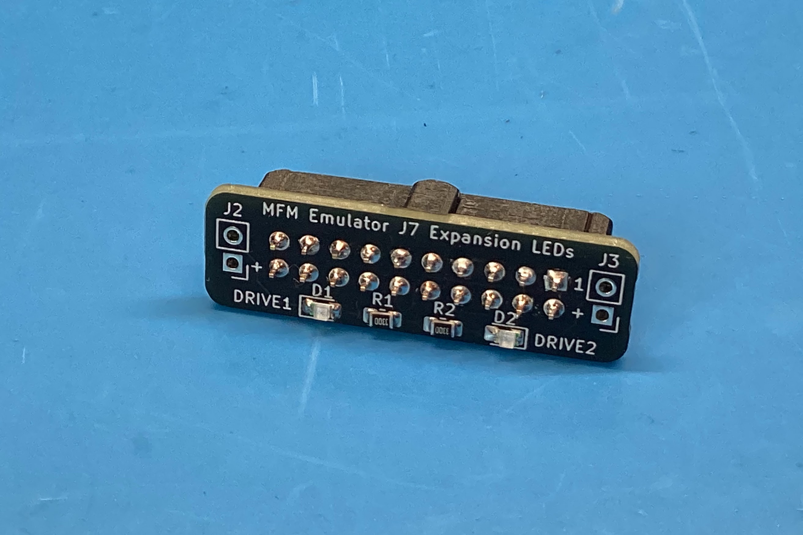
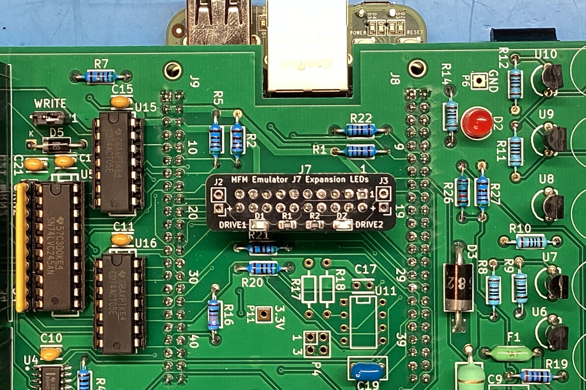
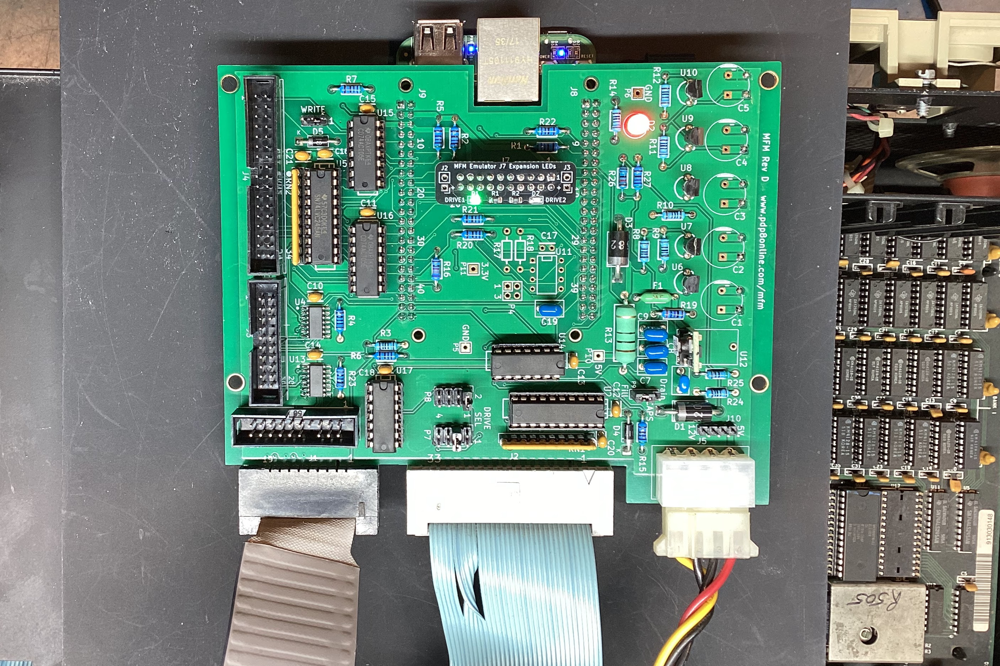
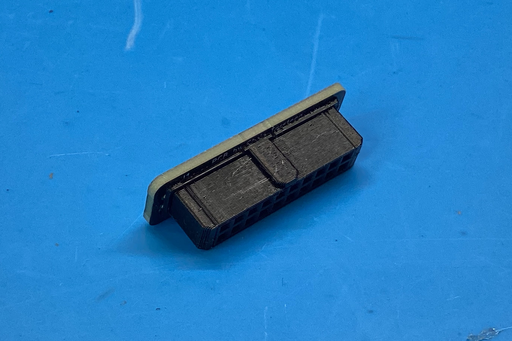
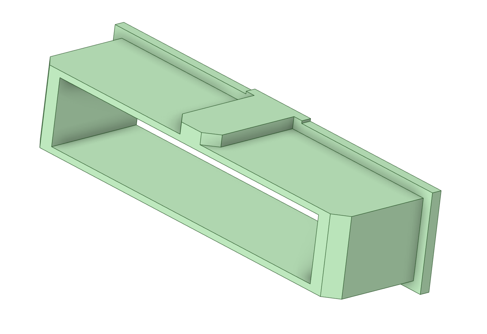

Simple PCB for the Drive 1 and Drive 2 select LED's exposed on the J7 expansion connector of [David Gesswein's MFM emulator](https://www.pdp8online.com/mfm/).  Plugs directly into the connector and uses 0805 SMD components for easier hand soldering.

I used 330R resistors which were plenty bright with the green LED's. Just make sure to limit current to no more than 6ma since these are driven right from the BeagleBone GPIO's. You can also use the board as a breakout to pin headers and install external LED's instead of the SMD mounted ones.

If you have a 3D printer, I also included a keyed sleeve that slides over a standard 2x10 2.54mm female pin socket and prevents you from potentially misaligning the board by one pin in the male IDC box socket.

### BOM

https://djtersteegc.github.io/MFM-Emulator-J7-LED-Board/ibom-v1.0.html